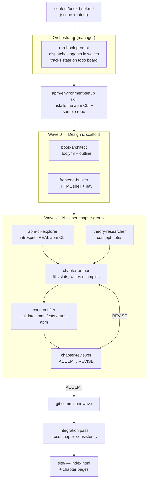

# Agent Package Manager — Interactive Book

An interactive, multi-page HTML book that teaches **Agent Package Manager (APM)** — starting from
high-level concepts ("why a dependency manager for agents?") and progressively drilling into the
real tool: the `apm.yml` manifest, the lockfile, primitives, the CLI, and policy — grounded in the
**actually-installed `apm` CLI**.

What makes this repository interesting is not just the book itself, but **how it was produced**:
by a small **fleet of GitHub Copilot primitives** (custom agents, skills, instruction files, and a
driver prompt) that collaborate under an orchestrator in a wave-based pipeline.

> 💡 **Inspired by [*The Agentic SDLC Handbook* by Daniel Meppiel](https://danielmeppiel.github.io/agentic-sdlc-handbook/handbook/ch01-the-agentic-sdlc-thesis.html)** — in particular its [case study on agentic handbook writing](https://danielmeppiel.github.io/agentic-sdlc-handbook/case-study-handbook-writing.html). This project applies that thesis: composing **primitives** (agents + prompts + skills + instructions) into a squad that produces real software artifacts.

> 🤖 **See the fleet in action:** an [**interactive orchestration wireframe**](site/orchestration.html) animates the exact pipeline (design → research → author → verify → review) that produced this book.

---

## The idea behind the fleet

Writing a technical book well requires several *different* skills that rarely live in one
person — or one prompt — at the same time:

- Someone who understands **concepts** and can explain them clearly.
- Someone who knows the **tool** deeply and won't hallucinate command names.
- Someone who can **write** approachable prose.
- Someone who **runs the commands** to prove every example works.
- Someone who **reviews** critically and catches mistakes.
- Someone who handles the **front-end** so it all reads as a coherent site.

Trying to do all of this in a single mega-prompt produces shallow, error-prone results: the model
guesses command flags from stale training data, examples don't run, and quality drifts chapter to
chapter.

**So instead of one generalist, we built a team of specialists.** Each role is encoded as a
*primitive* — a small, focused configuration file — and an **orchestrator** dispatches them like a
manager runs a team, in repeatable **waves** (research → author → verify → review → integrate).

### Two principles that drive quality

1. **Ground truth over training memory.** A dedicated *APM CLI Explorer* introspects the real
   installed `apm` CLI (commands, flags, and the `apm.yml` / `apm.lock.yaml` / `apm-policy.yml`
   schemas) to extract exact behavior. Every chapter is written against that ground truth — *not*
   against what the model "remembers" from blogs. This is critical: many public examples use
   outdated commands or invented flags. The fleet verifies the *real* surface by running
   `apm --help` and scaffolding a sample project.

2. **Executable proof.** Every example is a real `apm.yml` manifest or `apm` command that a
   *Code Verifier* validates/runs. Examples are network-guarded so they verify **without pushing or
   requiring private tokens** — proving the manifest resolves and the schema is valid.

---

## The fleet roster

All primitives live under [`.github/`](.github/) following GitHub Copilot conventions.

| Primitive | Type | Role |
| --- | --- | --- |
| `book-architect` | agent | Designs the table of contents and chapter outline from the brief. |
| `theory-researcher` | agent | Researches high-level concepts from APM docs; writes theory notes. |
| `apm-cli-explorer` | agent | **Introspects the installed `apm` CLI** to extract the real command + schema surface. |
| `chapter-author` | agent | Writes chapter prose + examples into the HTML page slots. |
| `code-verifier` | agent | Validates/runs every example; ensures manifests resolve and schemas are valid. |
| `chapter-reviewer` | agent | Reviews chapters for accuracy, consistency, and pitfalls (ACCEPT / REVISE). |
| `frontend-builder` | agent | Scaffolds the HTML shell, nav, styling, and final cross-links. |
| `apm-environment-setup` | skill | Reproducible recipe to install the `apm` CLI and a sample repo. |
| `book-orchestration` | skill | The wave-based pipeline definition the orchestrator follows. |
| `book-content` | instructions | Auto-applied content/style rules for every chapter. |
| `apm-examples` | instructions | Auto-applied rules for writing valid, verifiable manifest/command examples. |
| `run-book` | prompt | The master driver prompt that boots and coordinates the whole fleet. |

**Inputs that steer the fleet:** [`content/book-brief.md`](content/book-brief.md) (scope) and
[`content/toc.yml`](content/toc.yml) (chapter spec / source of truth).

---

## How it works — the flow



### The wave loop, in words

1. **Setup.** The orchestrator installs the `apm` CLI and scaffolds a sample project so the tool can
   be introspected and examples can be validated.
2. **Wave 0 — design.** The *architect* turns the brief into a concrete table of contents; the
   *frontend-builder* scaffolds the HTML shell with empty content slots.
3. **Content waves.** For each group of chapters, the *cli-explorer* extracts the real command and
   manifest surface, the *theory-researcher* gathers concepts, the *author* fills the page slots and
   writes example manifests/commands, the *verifier* validates every example (must resolve/validate
   without private tokens), and the *reviewer* signs off (routing REVISE notes back to the author
   until ACCEPT).
4. **Commit per wave.** Each completed wave is committed, keeping a clean, auditable history.
5. **Integration pass.** A final cross-chapter review checks navigation, terminology, progression,
   and command/manifest consistency across all chapters.

The orchestrator overlaps work where safe (e.g. researching the next wave while reviewing the
current one) and batches reviews to cut dispatch overhead.

---

## Repository layout

```
.github/
  agents/         # 7 specialist custom agents
  skills/         # environment setup + orchestration pipeline
  instructions/   # auto-applied content & example rules
  prompts/        # run-book driver + new-chapter helper
content/
  book-brief.md       # scope / intent
  toc.yml             # chapter spec (source of truth)
  research/           # per-chapter theory + reference notes
backend/
  samples/            # example apm.yml projects (+ apm.lock.yaml)
site/
  index.html
  chapters/*.html     # chapter subpages
  assets/             # style.css + app.js
scripts/
  run-fleet.ps1       # convenience launcher
```

---

## Run the book locally

```powershell
# from the repository root
cd site
python -m http.server
# then open http://localhost:8000
```

To install the `apm` CLI (needed for exploration/verification, not for viewing the site):

```powershell
irm https://aka.ms/apm-windows | iex   # Unix: curl -sSL https://aka.ms/apm-unix | sh
apm --version
```

> **Note:** example manifests and commands are verified against the installed `apm` CLI. Record the
> inspected version in research/verification artifacts — APM moves fast.

---

## Chapter arc

Concepts → tool → operations → governance. The exact chapters are decided by the `book-architect`
in [`content/toc.yml`](content/toc.yml) from the brief; the high-level topic areas are:

1. Why a package manager for AI agents?
2. Primitives and harnesses (skills, prompts, instructions, plugins, MCP servers)
3. The `apm.yml` manifest and dependency sources
4. Installing and restoring (`apm init`, `apm install`, `apm run`)
5. The lockfile and reproducibility (`apm.lock.yaml`, content hashes)
6. Security by default (Unicode scanning, hash pinning, transitive MCP blocking)
7. Governance and policy (`apm-policy.yml`, tighten-only inheritance)
8. Lifecycle (`apm update`, `apm outdated`, `apm audit`)
9. Producing and publishing packages
10. Enterprise: fleet-scale policy, audit, and CI gating

---

## Credits & inspiration

This project was **built on the foundation of [Valentina Alto](https://github.com/Valentina-Alto)'s [*Microsoft Agent Framework — Interactive Playbook*](https://github.com/Valentina-Alto/microsoft-agent-framework-playbook-fleets-generated)**, which served as the template and starting point for this book. The fleet-of-primitives roster, the wave-based orchestration pipeline, and the interactive HTML shell are all adapted from that project — retargeted here from the Microsoft Agent Framework to the Agent Package Manager.

That project — and this one — is in turn a direct application of **[*The Agentic SDLC Handbook* by Daniel Meppiel](https://danielmeppiel.github.io/agentic-sdlc-handbook/handbook/ch01-the-agentic-sdlc-thesis.html)** — the primary source of inspiration for the approach used here. The handbook's [case study on writing a handbook with agents](https://danielmeppiel.github.io/agentic-sdlc-handbook/case-study-handbook-writing.html) directly motivated the "fleet of primitives" model: encoding distinct roles as agents, prompts, skills, and instruction files, and orchestrating them in waves to produce verified artifacts.

The book content itself is grounded in the official **[Agent Package Manager documentation](https://microsoft.github.io/apm/)** and the installed `apm` CLI.

---

*Built by a fleet of GitHub Copilot primitives, orchestrated wave by wave, with every command
grounded in the installed CLI and every example proven to resolve.*
