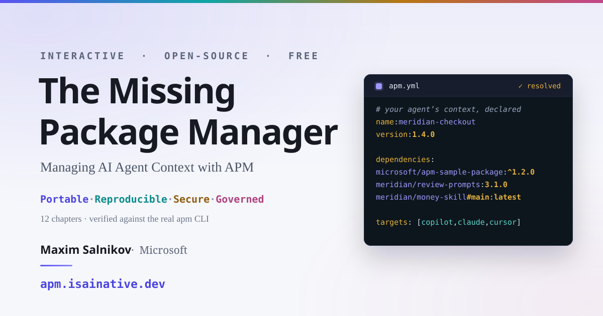
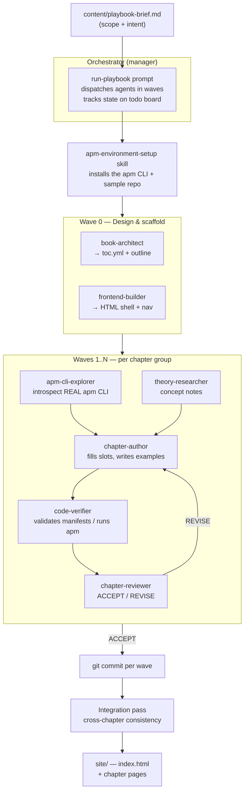

<p align="center">
  <a href="https://apm.isainative.dev/">
    
  </a>
</p>

<p align="center">
  <strong><a href="https://apm.isainative.dev/">Read the live interactive book&nbsp;→</a></strong>
</p>

# Agent Package Manager — Interactive Book

An interactive, multi-page HTML book that teaches **Agent Package Manager (APM)** — starting from
high-level concepts ("why a dependency manager for agents?") and progressively drilling into the
real tool: the `apm.yml` manifest, the lockfile, primitives, the CLI, and policy — grounded in the
**actually-installed `apm` CLI**.

What makes this repository interesting is not just the book itself, but **how it was produced**:
by a small **fleet of GitHub Copilot primitives** (custom agents, skills, instruction files, and a
driver prompt) that collaborate under an orchestrator in a wave-based pipeline.

> 💡 **Inspired by [*The Agentic SDLC Handbook* by Daniel Meppiel](https://danielmeppiel.github.io/agentic-sdlc-handbook/handbook/ch01-the-agentic-sdlc-thesis.html)** — in particular its [case study on agentic handbook writing](https://danielmeppiel.github.io/agentic-sdlc-handbook/case-study-handbook-writing.html). This project applies that thesis: composing **primitives** (agents + prompts + skills + instructions) into a squad that produces real software artifacts.

> 🤖 **See the fleet in action:** an [**interactive orchestration wireframe**](site/orchestration.html) animates the exact pipeline (design → research → author → verify → review) that produced this book.

---

## The idea behind the fleet

Writing a technical book well requires several *different* skills that rarely live in one
person — or one prompt — at the same time:

- Someone who understands **concepts** and can explain them clearly.
- Someone who knows the **tool** deeply and won't hallucinate command names.
- Someone who can **write** approachable prose.
- Someone who **runs the commands** to prove every example works.
- Someone who **reviews** critically and catches mistakes.
- Someone who handles the **front-end** so it all reads as a coherent site.

Trying to do all of this in a single mega-prompt produces shallow, error-prone results: the model
guesses command flags from stale training data, examples don't run, and quality drifts chapter to
chapter.

**So instead of one generalist, we built a team of specialists.** Each role is encoded as a
*primitive* — a small, focused configuration file — and an **orchestrator** dispatches them like a
manager runs a team, in repeatable **waves** (research → author → verify → review → integrate).

### Two principles that drive quality

1. **Ground truth over training memory.** A dedicated *APM CLI Explorer* introspects the real
   installed `apm` CLI (commands, flags, and the `apm.yml` / `apm.lock.yaml` / `apm-policy.yml`
   schemas) to extract exact behavior. Every chapter is written against that ground truth — *not*
   against what the model "remembers" from blogs. This is critical: many public examples use
   outdated commands or invented flags. The fleet verifies the *real* surface by running
   `apm --help` and scaffolding a sample project.

2. **Executable proof.** Every example is a real `apm.yml` manifest or `apm` command that a
   *Code Verifier* validates/runs. Examples are network-guarded so they verify **without pushing or
   requiring private tokens** — proving the manifest resolves and the schema is valid.

---

## The fleet roster

All primitives live under [`.github/`](.github/) following GitHub Copilot conventions.

| Primitive | Type | Role |
| --- | --- | --- |
| `book-architect` | agent | Designs the table of contents and chapter outline from the brief. |
| `theory-researcher` | agent | Researches high-level concepts from APM docs; writes theory notes. |
| `apm-cli-explorer` | agent | **Introspects the installed `apm` CLI** to extract the real command + schema surface. |
| `chapter-author` | agent | Writes chapter prose + examples into the HTML page slots. |
| `code-verifier` | agent | Validates/runs every example; ensures manifests resolve and schemas are valid. |
| `chapter-reviewer` | agent | Reviews chapters for accuracy, consistency, and pitfalls (ACCEPT / REVISE). |
| `frontend-builder` | agent | Scaffolds the HTML shell, nav, styling, and final cross-links. |
| `apm-environment-setup` | skill | Reproducible recipe to install the `apm` CLI and a sample repo. |
| `book-orchestration` | skill | The wave-based pipeline definition the orchestrator follows. |
| `book-content` | instructions | Auto-applied content/style rules for every chapter. |
| `apm-examples` | instructions | Auto-applied rules for writing valid, verifiable manifest/command examples. |
| `run-playbook` | prompt | The from-scratch driver that boots and coordinates the whole fleet. |
| `update-book` | prompt | Checks the complete upstream release gap and prepares targeted chapter updates. |
| `release-content` | prompt | Prepares an edition, or explicitly publishes its exact merged revision. |

**Inputs that steer the fleet:** [`content/playbook-brief.md`](content/playbook-brief.md) (scope) and
[`content/toc.yml`](content/toc.yml) (chapter spec / source of truth).

---

## How it works — the flow


```mermaid
flowchart TD
    Brief["content/playbook-brief.md<br/>(scope + intent)"] --> Orchestrator

    subgraph Driver["Orchestrator (manager)"]
        Orchestrator["run-playbook prompt<br/>dispatches agents in waves<br/>tracks state on todo board"]
    end

    Orchestrator --> Env["apm-environment-setup skill<br/>installs the apm CLI + sample repo"]

    subgraph Wave0["Wave 0 — Design & scaffold"]
        Architect["book-architect<br/>→ toc.yml + outline"]
        Frontend["frontend-builder<br/>→ HTML shell + nav"]
    end

    subgraph WaveN["Waves 1..N — per chapter group"]
        direction TB
        Explorer["apm-cli-explorer<br/>introspect REAL apm CLI"]
        Theory["theory-researcher<br/>concept notes"]
        Author["chapter-author<br/>fills slots, writes examples"]
        Verifier["code-verifier<br/>validates manifests / runs apm"]
        Reviewer["chapter-reviewer<br/>ACCEPT / REVISE"]

        Explorer --> Author
        Theory --> Author
        Author --> Verifier
        Verifier --> Reviewer
        Reviewer -- "REVISE" --> Author
    end

    Env --> Wave0
    Wave0 --> WaveN
    WaveN -- "ACCEPT" --> Commit["git commit per wave"]
    Commit --> Integration["Integration pass<br/>cross-chapter consistency"]
    Integration --> Site["site/ — index.html<br/>+ chapter pages"]
```

### The wave loop, in words

1. **Setup.** The orchestrator installs the `apm` CLI and scaffolds a sample project so the tool can
   be introspected and examples can be validated.
2. **Wave 0 — design.** The *architect* turns the brief into a concrete table of contents; the
   *frontend-builder* scaffolds the HTML shell with empty content slots.
3. **Content waves.** For each group of chapters, the *cli-explorer* extracts the real command and
   manifest surface, the *theory-researcher* gathers concepts, the *author* fills the page slots and
   writes example manifests/commands, the *verifier* validates every example (must resolve/validate
   without private tokens), and the *reviewer* signs off (routing REVISE notes back to the author
   until ACCEPT).
4. **Commit per wave.** Each completed wave is committed, keeping a clean, auditable history.
5. **Integration pass.** A final cross-chapter review checks navigation, terminology, progression,
   and command/manifest consistency across all chapters.

The orchestrator overlaps work where safe (e.g. researching the next wave while reviewing the
current one) and batches reviews to cut dispatch overhead.

---

## Repository layout

```
.github/
  agents/         # 7 specialist custom agents
  skills/         # environment setup + orchestration pipeline
  instructions/   # auto-applied content & example rules
  prompts/        # run-playbook, update-book, new-chapter, release-content
  workflows/      # check-book (PR checks), deploy-pages, release-content
content/
  playbook-brief.md   # scope / intent
  toc.yml             # chapter spec (source of truth)
  version.yml         # content edition/date + reviewed upstream APM version
  CHANGELOG.md        # what changed in each content edition
  research/           # per-chapter theory + reference notes
backend/
  examples/           # example apm.yml projects (+ apm.lock.yaml)
site/
  generate.py             # renders the HTML site from content/
  generate_pdf.py         # assembles a release-only PDF (Playwright/Chromium)
  extract_release_notes.py # turns a CHANGELOG section into GitHub Release notes
  release_metadata.py     # shared strict edition/changelog parsing
  validate_release.py     # content-delta and merged-tag preflight
  index.html
  chapters/*.html         # chapter subpages
  assets/                 # style.css + app.js
scripts/
  run-fleet.ps1       # bootstrap/update launcher, with dry-run and check-only modes
  check_upstream.py   # read-only, complete stable APM release-gap discovery
tests/               # offline regression tests for update/release tooling
```

---

## Run the book locally

```powershell
# from the repository root
cd site
python -m http.server
# then open http://localhost:8000
```

### Rebuild the site

The site (including the **[Get the free PDF](https://isainative.substack.com/p/free-agentic-workflows-book)**
link offered on every page) is generated from the same source of truth — `content/toc.yml` plus the
`content/chapters/*.html` fragments:

```powershell
# from the repository root — rebuilds every HTML page and SEO file
python .\site\generate.py
```

The GitHub Pages deployment publishes the HTML site only; it does not include a direct PDF file.
Release automation renders a versioned PDF separately for the GitHub Release asset. To build that
release artifact locally, install the toolchain once:

```powershell
python -m pip install pyyaml playwright
python -m playwright install chromium
```

Then run:

```powershell
python .\site\generate_pdf.py
```

The generated `site/apm-book.pdf` is gitignored and is used only as the source for a release asset.

### Free-tier Application Insights

The published site uses the cookieless Application Insights beacon in `analytics/entry.js`.
Provision an isolated workspace-based component with 30-day retention and a `0.16 GB/day`
ingestion cap:

```powershell
pwsh scripts/setup.ps1 -Name apm-book -Location eastus2
```

The setup script prints the public, write-only connection string. Store it as the
`APPINSIGHTS_CONNECTION_STRING` GitHub repository variable so the Pages and release builds inject
telemetry at build time; do not commit it or put it in a secret. To inspect the last 30 days:

```powershell
npm run report
```

For CLI exploration/verification, use the
[`apm-environment-setup`](.github/skills/apm-environment-setup/SKILL.md) skill. It prepares an
**exact-version CLI in a separate venv or checksum-verified release directory**, with scratch
projects and an absolute executable path shared by the agents. It does not upgrade your global CLI
or the book's installed authoring skills.
APM is not needed to view or build the site.

---

## Versioning & releases

This is a **living book**, so the *content* is versioned — independently of the site tooling. A
version bump means the chapters you read changed; build-script, analytics, or other infrastructure
changes never move the number.

- **Source of truth:** [`content/version.yml`](content/version.yml) holds the current edition
  (`major.minor`), its date, and `apm_version` (the upstream release reviewed for that edition);
  [`content/CHANGELOG.md`](content/CHANGELOG.md) records the reader-facing changes.
  The root `apm.lock.yaml` tracks installed authoring skills, not this reviewed baseline.
- **Where it shows:** the edition and its "updated" date render on the home hero, every page footer,
  the JSON-LD (`bookEdition`), `llms.txt`, and on the release PDF cover + page footer — all
  generated from the same source, so the online edition and the release PDF can never disagree.
  Sitemap dates also use the edition date, so rebuilding an old tag does not claim fresh content.
- **GitHub Releases:** each edition maps to a `vX.Y` tag. Pushing the tag runs
  [`release-content.yml`](.github/workflows/release-content.yml), which builds the site and a
  release-only PDF, turns the matching changelog section into the release notes, and attaches a per-edition
  `apm-book-vX.Y.pdf`.

### Update from an APM release

Invoke **`/update-book`** to prepare a targeted refresh, or give it **`Mode: check`** for a read-only
impact assessment. It discovers the latest stable APM release, reads the **whole gap** since the
book's reviewed baseline, maps changes to the TOC and chapter claims, and runs only affected
chapters through the existing research -> author -> verify -> review -> integrate loop.
It freezes one CLI target, preserves the structure/design and Meridian story, and stops with
locally committed, review-ready changes. It does **not** push, merge, tag, or publish.

Headless equivalents:

```powershell
# Print the intended invocation without starting agents
pwsh .\scripts\run-fleet.ps1 -UpdateBook -CheckOnly -DryRun

# Research the release gap and report the impact, without edits or installs
pwsh .\scripts\run-fleet.ps1 -UpdateBook -CheckOnly

# Prepare the update, optionally fixing the target rather than discovering latest
pwsh .\scripts\run-fleet.ps1 -UpdateBook -ApmVersion 0.31.0
```

The lightweight discovery helper needs only Python + PyYAML, not Copilot or an installed APM:

```powershell
python .\scripts\check_upstream.py
python .\scripts\check_upstream.py --target 0.31.0
```

It prints JSON with the baseline, frozen target, release dates/notes, and pinned changelog/compare
links. It uses public GitHub metadata without forwarding tokens, excludes drafts/prereleases,
and fails explicitly if discovery is unavailable or incomplete. Store working JSON in the
session artifacts directory. If no reader-facing changes are needed, do not bump the edition.

Actual verifier/reviewer reports are retained under `content/research/updates/<edition>/`.
Every affected example must PASS or have a specific, visible `SKIPPED-needs-network` reason;
each affected chapter and the integration pass must ACCEPT. CI validates metadata/provenance
and builds the book, **not** the factual accuracy of prose or execution of agent examples.
Never replace those gates with a green build or relabel old verification stamps without reruns.

### Prepare, then publish

Use **`/release-content`** after the content gates pass. Its default **prepare** mode updates
`content/version.yml` and the matching changelog section, requires a fresh HTML build plus a
release-only PDF build, and
commits only the reviewed update locally. Choose the next minor book edition for an incremental
content update; APM's `0.31.0` and the book's `1.2` are independent version numbers.

Before committing, with the real previous tag and proposed edition substituted:

```powershell
python .\site\validate_release.py --base-ref v1.1
python .\site\extract_release_notes.py 1.2
python .\site\generate.py
python .\site\generate_pdf.py
```

Stop on any failure. Missing/empty/duplicate notes, malformed metadata, edition/date mismatches,
reader-content changes without an edition bump, and tooling-only bumps are hard errors.

Publication is a separate explicit **`/release-content Mode: publish`** request, after review and
merge. Use a clean checkout of the **exact reviewed merge commit**, with `origin/main` refreshed:

```powershell
git tag v1.2 HEAD
python .\site\validate_release.py --tag v1.2
if ($LASTEXITCODE -ne 0) { throw "Do not push: release tag preflight failed" }
git push origin refs/tags/v1.2
```

The tag must equal the file edition, point at the checked-out commit, and be merged into
`origin/main`. Push **only the intended tag**, never every local tag. The two publishing paths
are separate: merging to `main` triggers **Deploy book to GitHub Pages**; pushing `vX.Y` triggers
**Publish content release**, which attaches `apm-book-vX.Y.pdf`. Confirm both expected runs,
the online edition, and the release notes before declaring publication complete.

To retry a failed release build, manually run **Publish content release** with its existing tag.
It rebuilds the **tag's inputs**, not later edits on `main`. Content corrections need a new edition
and tag; do not move public tags. Historical v1.0/v1.1 predate the release metadata/tooling at
their tags: keep their existing assets rather than attempting to reconstruct them with this flow.

The **Check book update** PR workflow runs the tooling regressions and preflight on Windows/Linux,
and builds the generated HTML on Linux without deployment permissions. Run its offline checks locally:

```powershell
python -m unittest discover -s tests -v
python .\site\validate_release.py
```

The current edition is **v1.2**, with all twelve chapters reviewed against **APM 0.31.0** and
current practice fixtures, explicit historical snapshots, and documented compatibility limits.
The [edition evidence](content/research/updates/1.2/integration-review.md) records the independent
verification and integration acceptance. **v1.1** added GitHub Agentic Workflows as a consumer;
**v1.0** was the initial 12-chapter edition. Browse the
[releases](https://github.com/webmaxru/agent-package-manager-book/releases) for version history and release notes.

---

## Chapter arc

Concepts → tool → operations → governance. The exact chapters are decided by the `book-architect`
in [`content/toc.yml`](content/toc.yml) from the brief; the high-level topic areas are:

1. Why a package manager for AI agents?
2. Primitives and harnesses (skills, prompts, instructions, plugins, MCP servers)
3. The `apm.yml` manifest and dependency sources
4. Installing and restoring (`apm init`, `apm install`, `apm run`)
5. The lockfile and reproducibility (`apm.lock.yaml`, content hashes)
6. Security by default (Unicode scanning, hash pinning, transitive MCP blocking)
7. Governance and policy (`apm-policy.yml`, tighten-only inheritance)
8. Lifecycle (`apm update`, `apm outdated`, `apm audit`)
9. Producing and publishing packages
10. Enterprise: fleet-scale policy, audit, and CI gating

---

## Credits & inspiration

This project was **built on the foundation of [Valentina Alto](https://github.com/Valentina-Alto)'s [*Microsoft Agent Framework — Interactive Playbook*](https://github.com/Valentina-Alto/microsoft-agent-framework-playbook-fleets-generated)**, which served as the template and starting point for this book. The fleet-of-primitives roster, the wave-based orchestration pipeline, and the interactive HTML shell are all adapted from that project — retargeted here from the Microsoft Agent Framework to the Agent Package Manager.

That project — and this one — is in turn a direct application of **[*The Agentic SDLC Handbook* by Daniel Meppiel](https://danielmeppiel.github.io/agentic-sdlc-handbook/handbook/ch01-the-agentic-sdlc-thesis.html)** — the primary source of inspiration for the approach used here. The handbook's [case study on writing a handbook with agents](https://danielmeppiel.github.io/agentic-sdlc-handbook/case-study-handbook-writing.html) directly motivated the "fleet of primitives" model: encoding distinct roles as agents, prompts, skills, and instruction files, and orchestrating them in waves to produce verified artifacts.

The book content itself is grounded in the official **[Agent Package Manager documentation](https://microsoft.github.io/apm/)** and the installed `apm` CLI.

---

*Built by a fleet of GitHub Copilot primitives, orchestrated wave by wave, with every command
grounded in the installed CLI and every example proven to resolve.*
